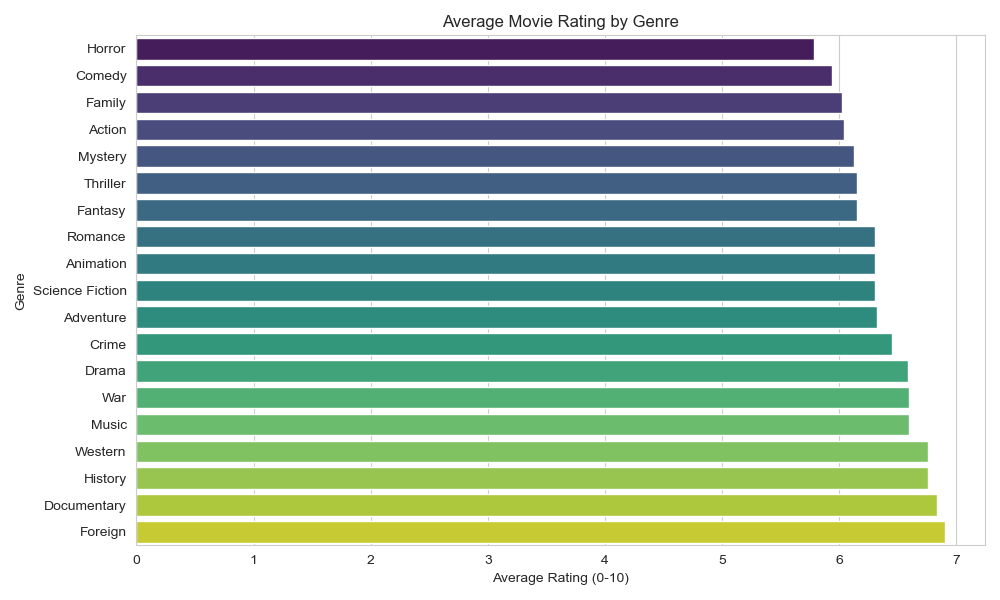
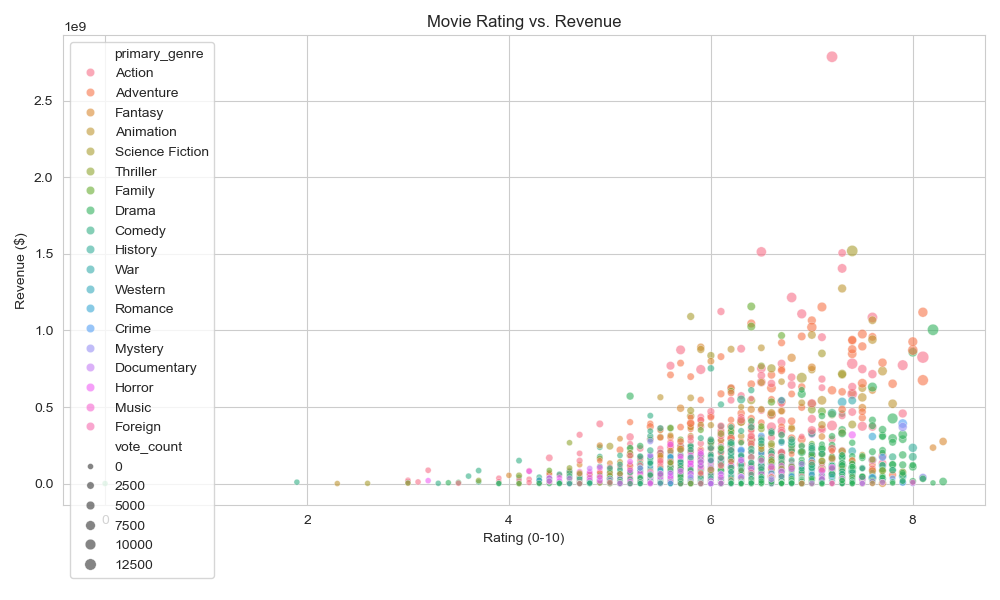
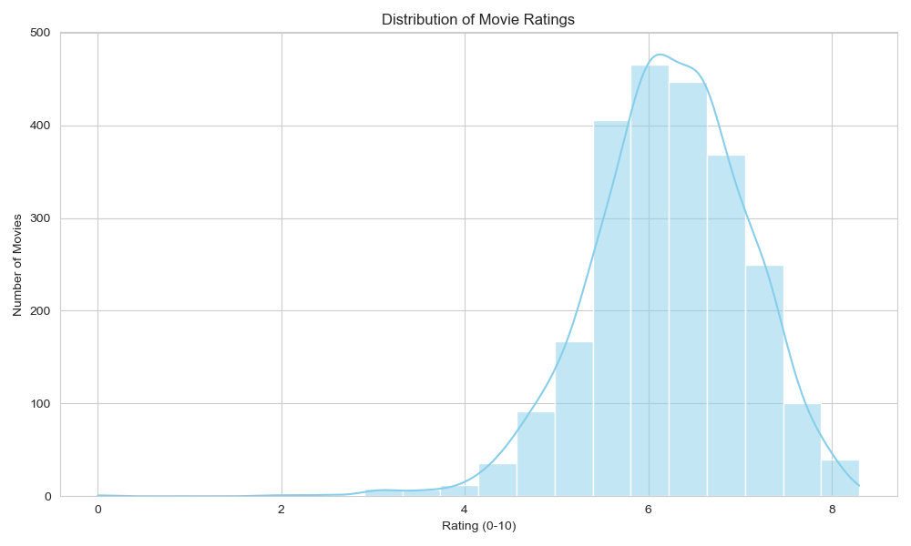

# Movie Ratings Visualization
My first data analysis project using Python in Jupyter Notebook! I analyzed the TMDB 5000 Movies dataset to explore movie ratings.

## Visualizations
- **Bar Chart**: Average rating by genre.
- **Scatter Plot**: Rating vs. revenue.
- **Histogram**: Distribution of ratings.

## Findings
- Documentaries and Dramas have the highest ratings.
- No clear link between ratings and revenue.
- Most movies are rated 6–8.

Check out my code in [Movie_Analysis.ipynb](Movie_Analysis.ipynb)!
